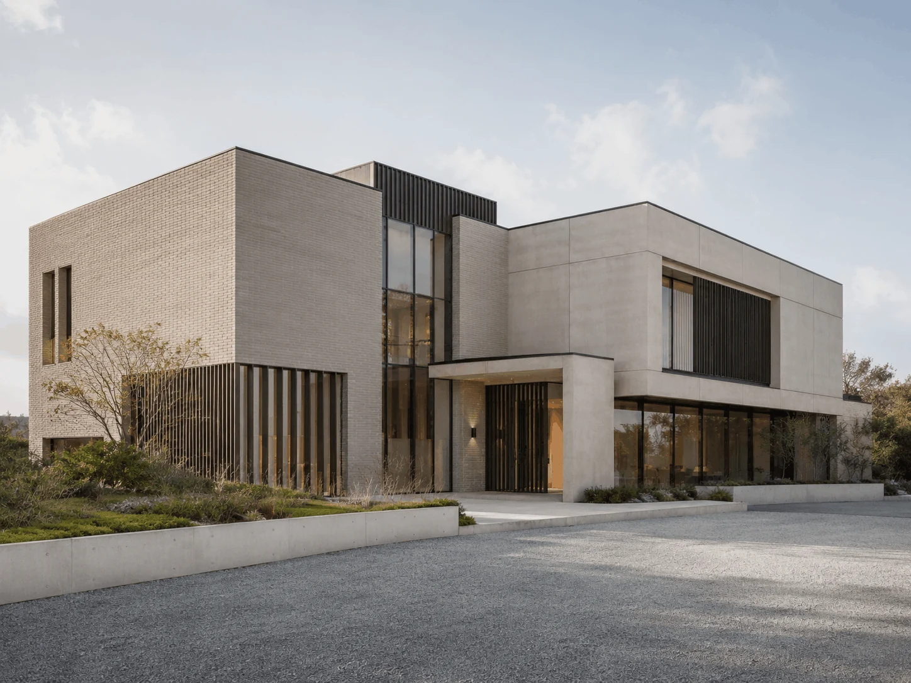

# STUDIO Archive

A 3D interactive project archive website for an independent architecture and spatial design practice. Built with vanilla JavaScript, CSS, and GSAP.



## Features

- **3D Ring Gallery** — 136 project cards arranged in a rotating 3D ring with depth-based opacity
- **Interactive Hover Effects** — Cards pull out and scale on hover with smooth GSAP animations
- **Bilingual Support** — English and Chinese (中文) with instant language switching
- **Responsive Design** — Full desktop experience with touch-based mobile interface
- **Custom Cursor** — Dot cursor that scales on interaction (desktop only)
- **Parallax Effects** — Mouse-driven parallax on the ring gallery
- **Scroll Rotation** — Mouse wheel rotates the ring with momentum physics
- **Loading Animation** — Branded loading screen with progress bar

## Project Structure

```
STUDIO Archive/
├── index.html          # Main HTML structure
├── script.js           # All JavaScript logic (ring, animations, i18n)
├── styles.css          # All styles (desktop + mobile)
└── assets/             # Project images
    ├── image-1.png
    ├── image-2.png
    ├── ...
    └── thumb/
```

## Technologies

- **HTML5** — Semantic markup with ARIA labels
- **CSS3** — Custom properties, 3D transforms, responsive design
- **Vanilla JavaScript** — ES6+, no framework dependencies
- **GSAP 3.12.5** — Animation library for smooth transitions

## Getting Started

No build step required. Open `index.html` in a modern browser.

```bash
# Option 1: Direct file open
open index.html

# Option 2: Local server (recommended)
npx serve .
```

## Categories

The archive includes 15 project categories:

| Category | Count |
|----------|-------|
| Shopping Mall | 42 |
| Outdoor Retail | 38 |
| Office | 34 |
| Mixed Use | 31 |
| Leisure | 26 |
| Residential | 24 |
| Renovation | 19 |
| High Rise | 18 |
| Hospitality | 17 |
| Sports | 15 |
| Cultural | 13 |
| Showroom | 12 |
| Store Design | 12 |
| Education | 9 |
| Transport | 6 |

## Browser Support

- Chrome 90+
- Firefox 88+
- Safari 14+
- Edge 90+

## License

All rights reserved. STUDIO®
